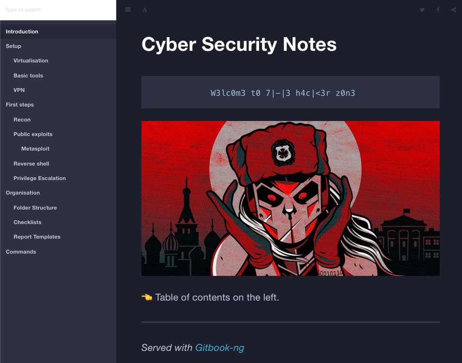
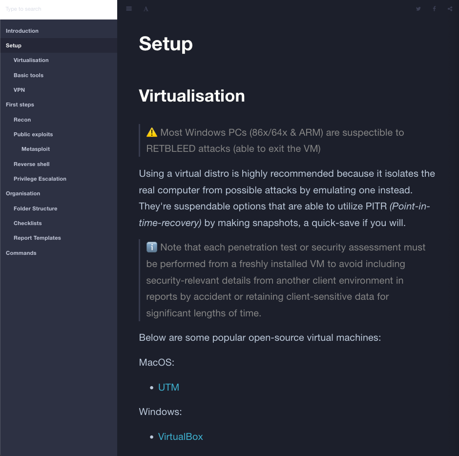
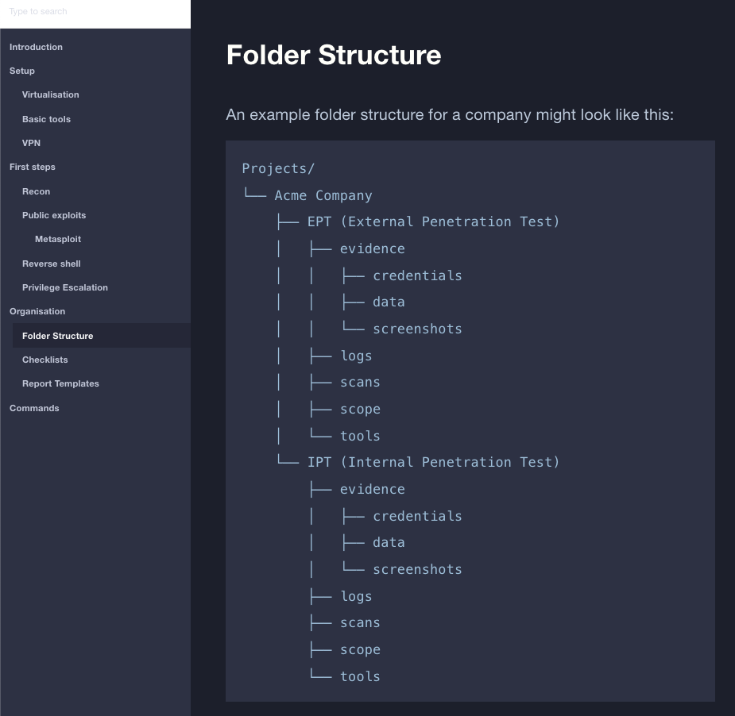
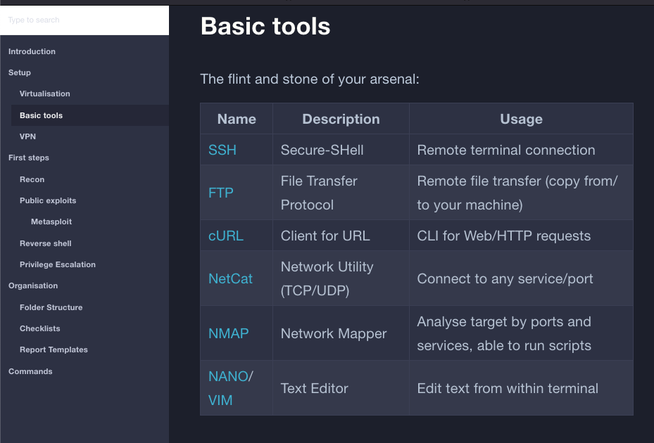
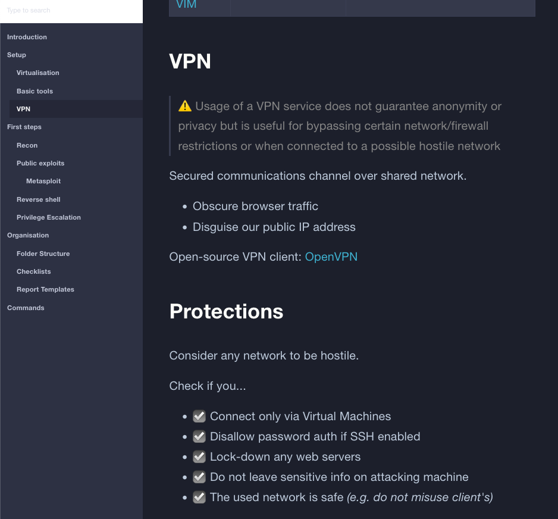
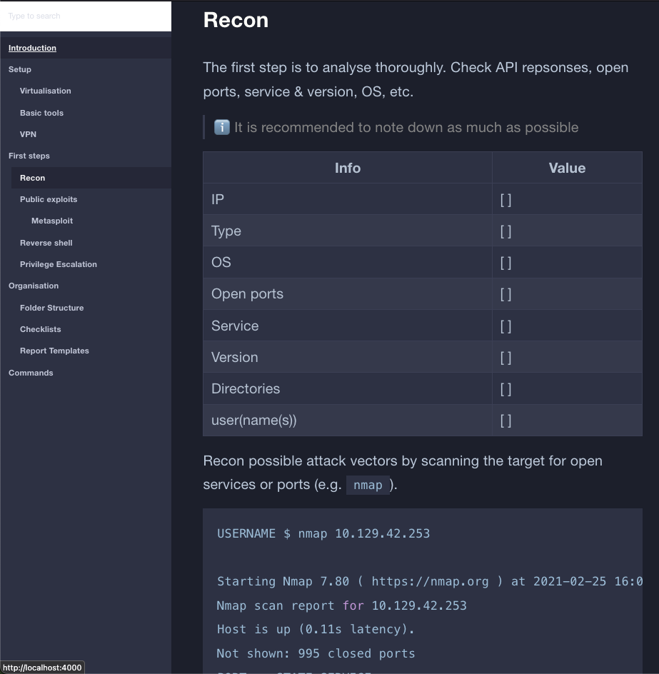
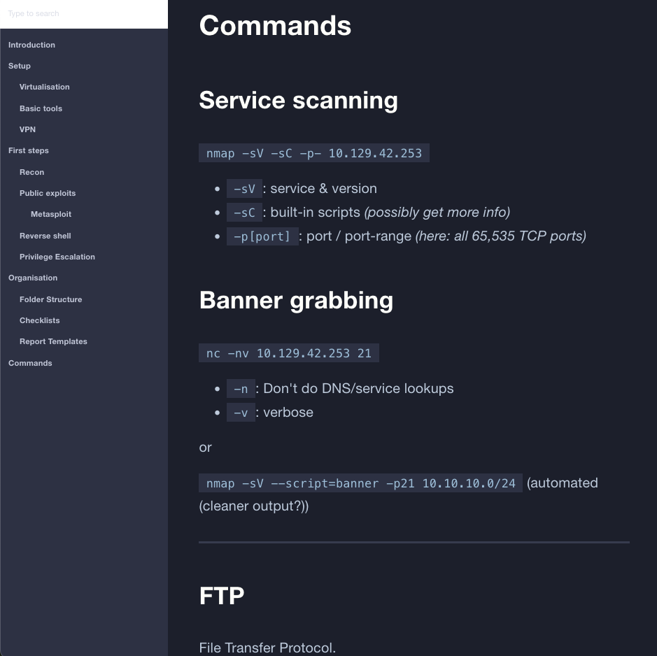

<!-- disable MD045 -->

# Cyber Security Documentation

Knowledge base for penetration testing & CTFs.

A local gitbook-ng I use for my own notes & learning.

## Preview

<!-- markdownlint-disable MD033 -->
<details>
  <summary>Click to expand</summary>

  

  

  

  

  

  

  
</details>

## Prerequisites

- Node.js
  - [NPM](https://docs.npmjs.com/downloading-and-installing-node-js-and-npm)
  - [NVM](https://github.com/nvm-sh/nvm?tab=readme-ov-file#installing-and-updating)

### Dependencies

- [GitBook-ng](https://gitbook-ng.github.io/setup.html)

## How to serve

Once NPM is installed run `make prepare` to install **GitBook-ng**:

Otherwise just order the machine to comply by chanting:

```sh
                - 'make' it damnit
```


List of make commands:

- `make serve` - serves gitbook (default: http://localhost:4000)
- `make build` - builds static site
- `make debug` - debugging during build
- `make prepare` - installs dependencies
